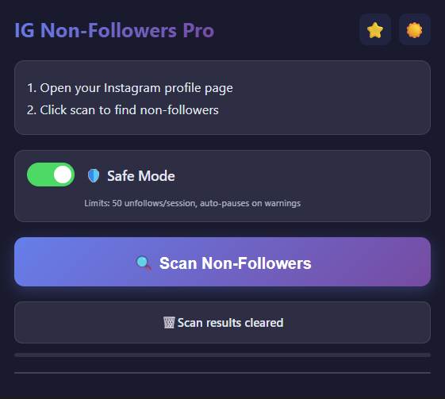
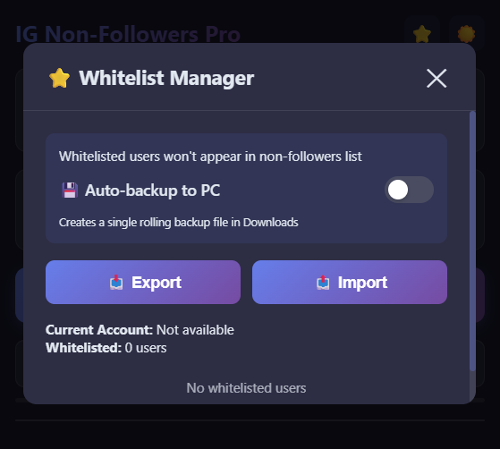
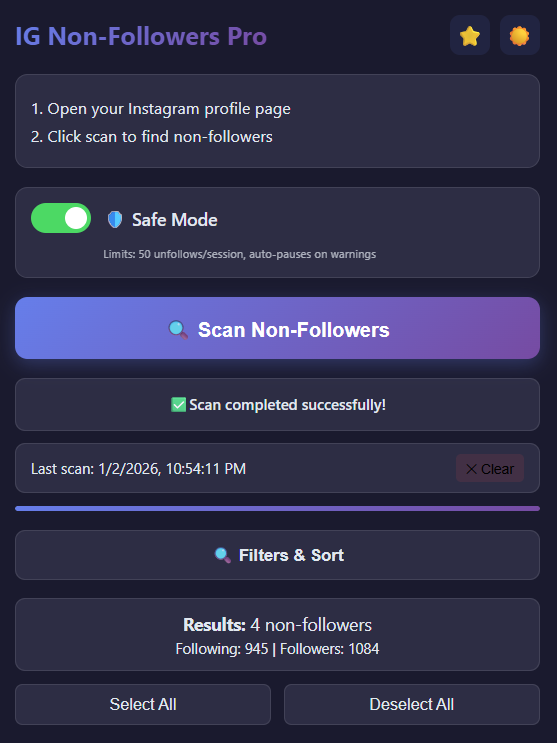

# 🚀 IG Non-Followers Pro - Chrome Extension

<div align="center">


**Advanced Instagram non-followers manager with intelligent whitelist, filters, and background scanning**

[Features](#-features) • [Installation](#-installation) • [Usage](#-usage) • [Architecture](#-architecture) • [Screenshots](#-screenshots) • [FAQ](#-faq)

</div>

---

## ✨ Features

### 🔍 **Background Scanning**

- **Non-blocking**: Start a scan and continue using your computer
- **Real-time progress**: Reopen the extension anytime to see live progress
- **Automatic completion**: Results appear when scan finishes, even if popup was closed
- **Cursor-based API**: Efficient GraphQL queries with pagination

### ⭐ **Smart Whitelist System**

- **Per-account whitelist**: Separate lists for multiple Instagram accounts
- **Visual indicators**: Gold star (★) for whitelisted users
- **Import/Export**: Backup and restore your whitelist as JSON
- **Auto-backup**: Optional automatic backup to Downloads folder
- **Event-driven updates**: Lists update instantly across all popups

### 🎯 **Advanced Filtering & Sorting**

- **Search**: Find users by username or full name
- **Sort options**:
  - Username (A-Z, Z-A)
  - Full name (A-Z, Z-A)
  - Default (fetch order)
- **Real-time filtering**: Results update as you type

### 🛡️ **Safe Mode Protection**

- **Rate limit protection**: Max 50 unfollows per 24-hour session
- **Auto-pause**: Detects Instagram warnings and pauses process
- **Random delays**: 12-18 second delays between unfollows
- **Session tracking**: Counts unfollows and resets daily

### 🎨 **Modern UI/UX**

- **Dark/Light themes**: Toggle between themes with one click
- **Smooth animations**: Fade-in effects and transitions
- **User previews**: Hover over username to see profile preview
- **Responsive design**: Optimized 450px popup window
- **Progress indicators**: Visual progress bars and loading states

### 📊 **Bulk Operations**

- **Select multiple users**: Up to 50 users at once
- **Batch unfollow**: Process multiple users with delays
- **Selection memory**: Selections persist between sessions
- **Quick actions**: Select all / Deselect all buttons

### 🔗 **Instagram Integration**

- **Direct profile links**: Click username to open Instagram profile
- **Avatar loading**: Fetches and caches profile pictures
- **User previews**: Shows posts, followers, following, bio
- **CSRF token handling**: Automatic authentication

---

## 📦 Installation

### **Method 1: Load Unpacked (Development)**

1. **Download or Clone the Repository**

   ```bash
   git clone https://github.com/yourusername/ig-nonfollowers-pro.git
   cd ig-nonfollowers-pro
   ```

2. **Open Chrome Extensions Page**

   - Navigate to `chrome://extensions/`
   - Enable **Developer mode** (top right)

3. **Load Extension**

   - Click **"Load unpacked"**
   - Select the extension folder
   - Extension icon will appear in toolbar

4. **Pin Extension** (Optional)
   - Click the puzzle icon in Chrome toolbar
   - Pin "IG Non-Followers Pro"

### **Method 2: Chrome Web Store**

_Coming soon..._

---

## 🎯 Usage

### **Quick Start**

1. **Open Instagram**

   - Go to `instagram.com` and log in
   - Navigate to your profile page (recommended but not required)

2. **Open Extension**

   - Click the extension icon in Chrome toolbar
   - Or use keyboard shortcut (if set)

3. **Start Scan**

   - Click **"🔍 Scan Non-Followers"**
   - Popup can be closed - scan continues in background
   - Reopen anytime to see progress

4. **View Results**
   - See list of users who don't follow you back
   - Use filters and sorting to organize results
   - Select users to unfollow

### **Whitelist Management**

#### **Add to Whitelist**

- Click the **star icon** (☆) next to any user
- Star turns gold (★) when whitelisted
- User disappears from non-followers list

#### **Remove from Whitelist**

- Click the **gold star** (★) to remove
- Or use **"⭐ Whitelist Manager"** button
- User reappears in list if still not following back

#### **Export Whitelist**

```javascript
// Exported JSON structure
{
  "user_id_1": [
    {
      "username": "example_user",
      "full_name": "Example User",
      "profile_pic_url": "https://...",
      "added_at": 1704240000000
    }
  ],
  "user_id_2": [...]
}
```

#### **Import Whitelist**

1. Click **"📤 Import"** in Whitelist Manager
2. Select previously exported JSON file
3. Lists merge automatically (no duplicates)
4. Count updates immediately

### **Unfollowing Users**

#### **Single Unfollow**

- Click **"Unfollow"** button next to user
- Confirmation in status bar
- User removed from list after success

#### **Bulk Unfollow**

1. Select users (checkbox or click row)
2. Click **"🚫 Unfollow Selected (X)"**
3. Process runs with delays
4. Progress shown in real-time

#### **Safe Mode** (Recommended)

- **Enabled by default**
- Limits: 50 unfollows per 24 hours
- Auto-pauses on Instagram warnings
- Resets at midnight daily

---

## 🏗️ Architecture

### **Manifest V3 Design**

```
┌─────────────────────────────────────────────────────────┐
│                    Extension Flow                        │
└─────────────────────────────────────────────────────────┘

popup.js (UI Only)
    ↓ triggers scan
content.js (Relay/Bridge)
    ↓ injects
pageScript.js (Instagram Context)
    ↓ emits events
content.js (Forwards to background)
    ↓ messages
background.js (Single Source of Truth)
    ↓ stores state in chrome.storage.local
    ↓ broadcasts to all popups
popup.js (Reads & Displays)
```

### **File Structure**

```
📦 IG_extension/
├── 📄 manifest.json          # Extension configuration (Manifest V3)
├── 📄 background.js          # Service worker - scan manager
├── 📄 content.js             # Content script - bridge/relay
├── 📄 pageScript.js          # Injected into Instagram page
├── 📄 unfollowScript.js      # Handles unfollow operations
├── 📄 previewScript.js       # Fetches user preview data
├── 📄 popup.html             # Extension popup UI
├── 📄 popup.js               # UI logic (event-driven)
├── 📄 popup.css              # Styles (light/dark themes)
└── 📁 assets/                # Icons (16, 32, 48, 128px)
```

### **Key Components**

#### **1. Background Service Worker** (`background.js`)

- **Single source of truth** for scan state
- Stores all data in `chrome.storage.local`
- Broadcasts updates to all popup instances
- Handles image fetching (CORS bypass)
- Manages scan lifecycle (STARTED → PROGRESS → COMPLETE/ERROR)

#### **2. Content Script** (`content.js`)

- **Bridge** between page and background
- Injects `pageScript.js` into Instagram page
- Relays events via `chrome.runtime.sendMessage()`
- Never depends on popup lifecycle

#### **3. Page Script** (`pageScript.js`)

- Runs in **Instagram page context**
- Accesses Instagram's GraphQL API
- Uses **cursor-based pagination**
- Emits custom events:
  - `IG_SCAN_PROGRESS`
  - `IG_NON_FOLLOWERS_COMPLETE`
  - `IG_NON_FOLLOWERS_ERROR`

#### **4. Popup UI** (`popup.js`)

- **Read-only** from storage
- Polls `chrome.storage.local` for updates
- **Event-driven**: Uses `chrome.storage.onChanged`
- Never runs scanning logic
- Triggers scan via `chrome.tabs.sendMessage()`

### **Storage Schema**

```javascript
chrome.storage.local {
  // Scan state
  scanInProgress: boolean,
  scanProgress: { message: string, percent: number },
  scanData: {
    followers: number,
    following: number,
    nonFollowers: Array<User>
  },
  lastScan: timestamp,
  scanError: string,

  // User data
  whitelist: { [userId]: Array<User> },
  unfollowedUsers: Array<username>,

  // Settings
  safeModeEnabled: boolean,
  sessionUnfollowCount: number,
  sessionStartTime: timestamp,
  theme: "light" | "dark",
  autoBackupEnabled: boolean,
  selectedUsers: Array<index>,
  lastSort: string
}
```

---

## 📸 Screenshots

### **Main Interface**


_Scan results with filters, sorting, and whitelist indicators_

### **Whitelist Manager**


_Manage whitelisted users with import/export_

### **Dark Theme**


_Beautiful dark mode for night scanning_

---

## ⚙️ Configuration

### **Safe Mode Settings**

```javascript
// In popup.js
const SAFE_MODE_LIMIT = 50; // Max unfollows per 24 hours
const UNFOLLOW_DELAY_MIN = 12000; // 12 seconds
const UNFOLLOW_DELAY_MAX = 18000; // 18 seconds
```

### **API Configuration**

```javascript
// In pageScript.js
const QUERY_HASHES = {
  followers: "c76146de99bb02f6415203be841dd25a",
  following: "d04b0a864b4b54837c0d870b0e77e076",
};

const FETCH_BATCH_SIZE = 50; // Users per API request
const REQUEST_DELAY = 1000; // 1 second between requests
```

### **Storage Limits**

- `chrome.storage.local`: ~10MB (sufficient for large lists)

---

## 🔧 Development

### **Prerequisites**

- Chrome Browser (v88+)
- Basic knowledge of JavaScript
- Instagram account for testing

### **Local Setup**

```bash
# Clone repository
git clone https://github.com/DusB70/Instagram_Non_Followers.git
cd ig-nonfollowers-pro

# No build step required - pure vanilla JS
```

### **Testing**

1. Load extension in Chrome (`chrome://extensions/`)
2. Open Instagram and log in
3. Test scan functionality
4. Check console logs:
   - Background: `chrome://extensions/` → "service worker"
   - Content: Right-click page → Inspect → Console
   - Popup: Right-click popup → Inspect

### **Debugging**

```javascript
// Enable verbose logging in popup.js
console.log("[IG Non-Followers Popup] Debug:", data);

// Check background logs
chrome.runtime.onMessage.addListener((msg) => {
  console.log("[Background Debug]", msg);
});

// Inspect storage
chrome.storage.local.get(null, (data) => {
  console.log("All storage:", data);
});
```

---

## 🐛 Troubleshooting

### **User Preview Shows "Rate Limited"**

- ⏸️ **Too many previews**: Wait 1-2 minutes before hovering again
- 🔄 **Cached previews**: Data is cached for 5 minutes to reduce requests
- ⏱️ **Auto rate limiting**: Extension waits 2 seconds between preview requests
- 💡 **Tip**: Open profiles directly instead of hovering on many users quickly

### **Scan Not Starting**

- ✅ Make sure you're on `instagram.com`
- ✅ Check if you're logged in (cookies present)
- ✅ Reload Instagram page
- ✅ Try opening your profile page first

### **"CSRF token not found"**

- 🔄 Refresh Instagram page
- 🍪 Clear cookies and log in again
- 🚫 Check if Instagram has changed API

### **Whitelist Count Shows 0 After Import**

- ✅ **Fixed in v3.0** - Event-driven updates
- 🔄 If issue persists, reopen popup

### **Rate Limit / "Try again later"**

- ⏸️ Safe Mode will auto-pause
- ⏰ Wait 24 hours before resuming
- 🛡️ Always use Safe Mode

### **Extension Not Loading**

```bash
# Check manifest.json syntax
cat manifest.json | jq .

# Look for errors in chrome://extensions/
# Click "Errors" button if red badge appears
```

---

## 📋 FAQ

### **Q: Is this safe to use?**

**A:** Yes, with Safe Mode enabled (default). It limits unfollows to 50/day and uses delays to avoid detection. However, use at your own risk - Instagram's policies change.

### **Q: Can I use this on multiple accounts?**

**A:** Yes! Whitelist is stored per-account. Just log in to different accounts and scan separately.

### **Q: Will Instagram ban me?**

**A:** Unlikely with Safe Mode. The extension uses human-like delays and respects rate limits. However, aggressive unfollowing can trigger warnings.

### **Q: Does the scan work if I close the browser?**

**A:** No, the browser must stay open. But you can close the popup - the scan continues in the background tab.

### **Q: Can I undo unfollows?**

**A:** No, unfollows are permanent. Use the whitelist feature to protect important accounts.

### **Q: Why are some users missing from the list?**

**A:** Private accounts or users who blocked you may not appear. Also, whitelisted users are filtered out.

### **Q: How do I export my whitelist?**

**A:** Click "⭐ Whitelist Manager" → "📥 Export". A JSON file will download. Import it later with "📤 Import".

### **Q: Can I scan without opening my profile?**

**A:** Yes! The extension can detect your user ID from cookies or page data. However, being on your profile page is more reliable.

---

## 🛡️ Privacy & Security

### **Data Storage**

- All data stored **locally** in browser (`chrome.storage.local`)
- **No external servers** or analytics
- **No user tracking**
- Whitelist and settings never leave your device

### **Permissions Explained**

```json
{
  "activeTab": "Access current Instagram tab",
  "scripting": "Inject scripts into Instagram page",
  "storage": "Save whitelist and settings locally",
  "downloads": "Export whitelist as JSON file",
  "unlimitedStorage": "Store large follower lists",
  "host_permissions": "Access Instagram API and images"
}
```

### **Instagram API Usage**

- Uses **official GraphQL endpoints**
- No credentials stored by extension
- Uses your active session cookies
- Respects rate limits

---

## 🤝 Contributing

Contributions are welcome! Please follow these guidelines:

### **Bug Reports**

```markdown
**Description**: Clear description of the bug
**Steps to Reproduce**:

1. Open extension
2. Click scan
3. ...

**Expected Behavior**: What should happen
**Actual Behavior**: What actually happens
**Screenshots**: If applicable
**Browser Version**: Chrome 120.0.6099.109
**Extension Version**: 3.0.0
```

### **Feature Requests**

- Open an issue with `[FEATURE]` prefix
- Explain use case and benefits
- Include mockups if UI-related

### **Pull Requests**

```bash
# Fork and clone
git clone https://github.com/yourfork/Instagram_Non_Followers.git
cd ig-nonfollowers-pro

# Create feature branch
git checkout -b feature/your-feature-name

# Make changes and test thoroughly
# ...

# Commit with clear message
git commit -m "feat: add export to CSV feature"

# Push and create PR
git push origin feature/your-feature-name
```

---

## 📜 License

MIT License - see [LICENSE](LICENSE) file for details.

```
MIT License

Copyright (c) 2026 IG Non-Followers Pro

Permission is hereby granted, free of charge, to any person obtaining a copy
of this software and associated documentation files (the "Software"), to deal
in the Software without restriction, including without limitation the rights
to use, copy, modify, merge, publish, distribute, sublicense, and/or sell
copies of the Software...
```

---

## 🙏 Acknowledgments

- **Instagram GraphQL API**: For providing access to follower data
- **Chrome Extensions API**: For robust Manifest V3 framework
- **Community**: For testing and feedback

---

## 📞 Support

- 🐛 **Bug Reports**: [GitHub Issues](https://github.com/DusB70/Instagram_Non_Followers.git)
- 💡 **Feature Requests**: [GitHub Discussions](https://github.com/DusB70/Instagram_Non_Followers.git/discussions)
- 📧 **Email**: thanushanga@gmail.com
- 🌟 **Star this repo** if you find it useful!

---

## ⚠️ Disclaimer

This extension is **not affiliated with, endorsed by, or sponsored by Instagram or Meta Platforms, Inc.** Use at your own risk. The developers are not responsible for any account restrictions or bans resulting from the use of this extension.

**Always use Safe Mode and follow Instagram's Terms of Service.**

---

<div align="center">

**Made with ❤️ by developers, for developers**

[⬆ Back to Top](#-ig-non-followers-pro---chrome-extension)

</div>
